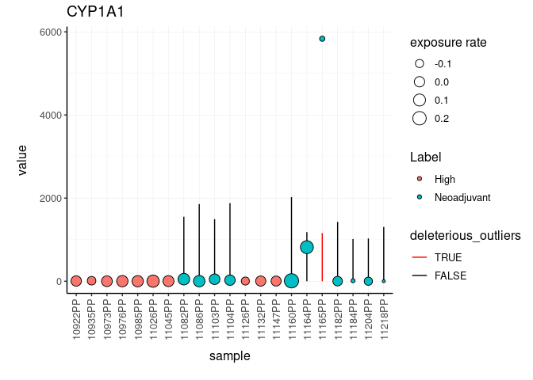

Posterior predictive check for bulk RNA sequencing data
================

The input data set is a tidy representation of a differential gene
transcript abundance analysis

To install:

Before install, for linux systems, in order to exploit multi-threading,
from R write:

``` r
dir.create(file.path("~/", ".R"), showWarnings = FALSE)
fileConn<-file("~/.R/Makevars")
writeLines(c( "CXX14FLAGS += -O3","CXX14FLAGS += -DSTAN_THREADS", "CXX14FLAGS += -pthread"), fileConn)
close(fileConn)
```

Then, install with

``` r
devtools::install_github("stemangiola/ppcseq")
```

You can get the test dataset with

``` r
data("counts")
counts 
```

    ## # A tibble: 394,821 x 9
    ##    sample  symbol   logCPM    LR   PValue        FDR value       W Label      
    ##    <chr>   <chr>     <dbl> <dbl>    <dbl>      <dbl> <int>   <dbl> <chr>      
    ##  1 10922PP SLC16A12   1.39  41.1 1.46e-10 0.00000274   160 -0.129  High       
    ##  2 10935PP SLC16A12   1.39  41.1 1.46e-10 0.00000274   150 -0.127  High       
    ##  3 10973PP SLC16A12   1.39  41.1 1.46e-10 0.00000274   146 -0.426  High       
    ##  4 10976PP SLC16A12   1.39  41.1 1.46e-10 0.00000274   347 -0.0164 High       
    ##  5 10985PP SLC16A12   1.39  41.1 1.46e-10 0.00000274   175 -0.135  High       
    ##  6 11026PP SLC16A12   1.39  41.1 1.46e-10 0.00000274   244  0.125  High       
    ##  7 11045PP SLC16A12   1.39  41.1 1.46e-10 0.00000274   399 -0.0892 High       
    ##  8 11082PP SLC16A12   1.39  41.1 1.46e-10 0.00000274   100  0.261  Neoadjuvant
    ##  9 11086PP SLC16A12   1.39  41.1 1.46e-10 0.00000274    37 -0.132  Neoadjuvant
    ## 10 11103PP SLC16A12   1.39  41.1 1.46e-10 0.00000274    73  0.146  Neoadjuvant
    ## # … with 394,811 more rows

You can identify anrtefactual calls from your differential transcribt
anundance analysis, due to outliers.

``` r
# Import libraries


counts.ppc = 
    counts |>
    mutate(is_significant = FDR < 0.01) |>
    identify_outliers(
        formula = ~ Label,
        .sample = sample, 
        .transcript = symbol,
        .abundance = value,
        .significance = PValue,
        .do_check = is_significant,
        percent_false_positive_genes = 5
    )
```

The new posterior predictive check has been added to the original data
frame

``` r
counts.ppc 
```

    ## # A tibble: 15 x 4
    ##    symbol   sample_wise_data   ppc_samples_failed tot_deleterious_outliers
    ##    <chr>    <list>                          <int>                    <int>
    ##  1 SLC16A12 <tibble [21 × 12]>                  0                        0
    ##  2 CYP1A1   <tibble [21 × 12]>                  1                        1
    ##  3 ART3     <tibble [21 × 12]>                  0                        0
    ##  4 DIO2     <tibble [21 × 12]>                  0                        0
    ##  5 OR51E2   <tibble [21 × 12]>                  0                        0
    ##  6 MUC16    <tibble [21 × 12]>                  0                        0
    ##  7 CCNA1    <tibble [21 × 12]>                  0                        0
    ##  8 LYZ      <tibble [21 × 12]>                  1                        1
    ##  9 PPM1H    <tibble [21 × 12]>                  0                        0
    ## 10 SUSD5    <tibble [21 × 12]>                  0                        0
    ## 11 TPRG1    <tibble [21 × 12]>                  0                        0
    ## 12 EPB42    <tibble [21 × 12]>                  0                        0
    ## 13 LRRC38   <tibble [21 × 12]>                  0                        0
    ## 14 SUSD4    <tibble [21 × 12]>                  0                        0
    ## 15 MMP8     <tibble [21 × 12]>                  0                        0

The new data frame contains plots for each gene

We can visualise the top five differentially transcribed genes

``` r
counts.ppc_plots = 
    counts.ppc |> 
    plot_credible_intervals() 
```

``` r
counts.ppc_plots |>
    pull(plot) |> 
    head(2)
```

    ## [[1]]

<!-- -->

    ## 
    ## [[2]]

<!-- -->
